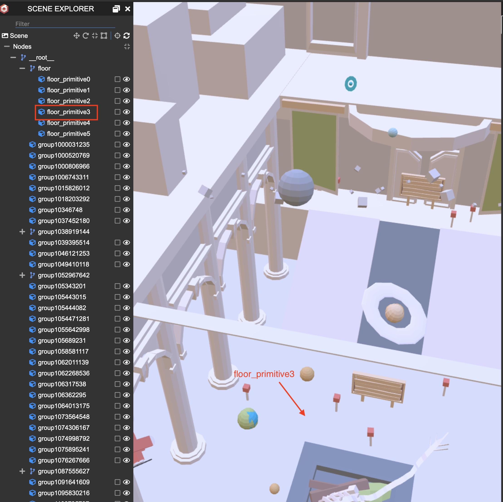

# Offline WebXR content sample with Babylonjs and PWA

# Background

The normal WebXR content requires internet connection. The repository has offline WebXR contents with Babylonjs and PWA.  

# Feature

* offline  

* compatible with Oculus Quest2

The initial release of the repository was 2019. The updated version is compatible with Oculus Quest2 (=Meta Quest2).  
The updated version is also compatible with WebXR because WebVR has been deprecated. 

# Usage

1. Access the URL by Oculus Quest.
https://flushpot1125.github.io/bjs_pwa_example/  

2. Disabled your wifi on Quest.

3. Try access the URL again.

4. You can see the content without wifi connection.

<b>Attention</b>
You can only dive into VR and tereport because it is an offline experiment. (Not refiend) 

# Make environment

Put all the files in your server compatible with https (e.g. Github pages)
# Known issues

You can teleport on the defined meshes with xr-standard-Trigger button and thumbstick.  
But once you move on "floor_primitive3", you can not use teleport feature anymore.  

# model

Thanks for great models.

## The Entryway - Museum Diorama  (by Joshua Johanson)
https://poly.google.com/view/9bdkTVw8GE8

