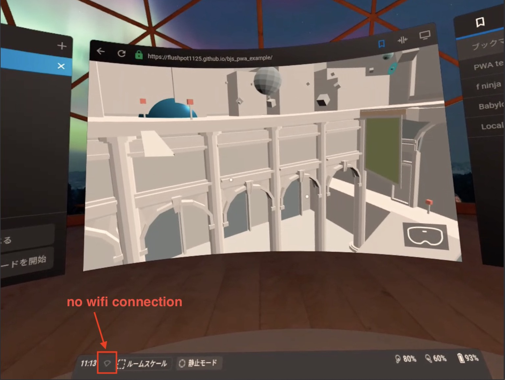

# offline content sample with Babylonjs

# Background

The normal WebXR content requires internet connection. The repository has offline WebXR contents with Babylonjs and PWA.  

# Feature

* offline  

* compatible with Oculus Quest

# Usage

1. Access the URL by Oculus Quest.
https://flushpot1125.github.io/bjs_pwa_example/  

2. Disabled your wifi on Quest.

3. Try access the URL again.

4. You can see the content without wifi connection.

<b>Attention</b>
You can only dive into VR and tereport because it is an offline experiment. (Not refiend) 

# Known issues

Currently offline is not permanent. You somtimes need to access the URL. 

# model

Thanks for great models.

## The Entryway - Museum Diorama  (by Joshua Johanson)
https://poly.google.com/view/9bdkTVw8GE8

